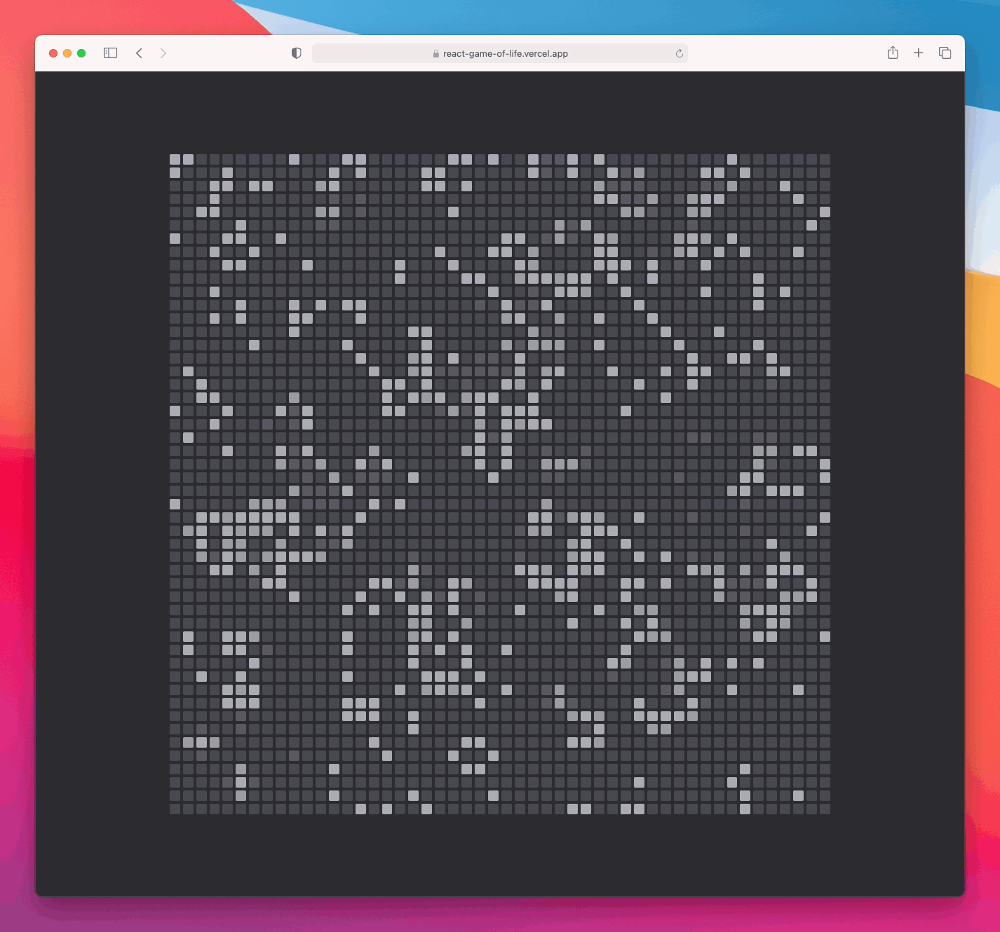

<h1 align="center">react-game-of-life</h1>

    <strong>A React implementation of Conway's Game of Life with Next.js and CSS Modules.</strong>

 
    
    

    <a href="#-screenshots"><b>Screenshots</b></a>
      •  
    <a href="#-development"><b>Development</b></a>
      •  
    <a href="#-contribute"><b>Contribute</b></a>  

---

The [Game of Life](https://en.wikipedia.org/wiki/Conway%27s_Game_of_Life), also
known simply as Life, is a cellular automaton devised by the British
mathematician John Horton Conway in 1970.

It is a zero-player game, meaning that its evolution is determined by its
initial state, requiring no further input.

This is a web implementation of Conway's Game of Life using React, Next.js and
CSS modules.

 

## ❯ Screenshots

 

## ❯ Development

1. **Requirements**

    You should have an LTS version of [Node.js](https://nodejs.org/en/)
    installed installed as well as
    [Yarn Classic](https://classic.yarnpkg.com/en/).

2. **Install the dependencies**

    Run `yarn install` to install all neccesary packages.

3. **Run the application**

    Start the development server by running `yarn dev`.

 

## ❯ Contribute

If you think you have any ideas that could benefit the project, feel free to
create a pull request!

 

---

    
        Project by Leo Driesch, released under <a href="https://github.com/leodr/react-game-of-life/blob/main/LICENSE">MIT license</a>.
    

    
    &nbsp;&nbsp;
    

