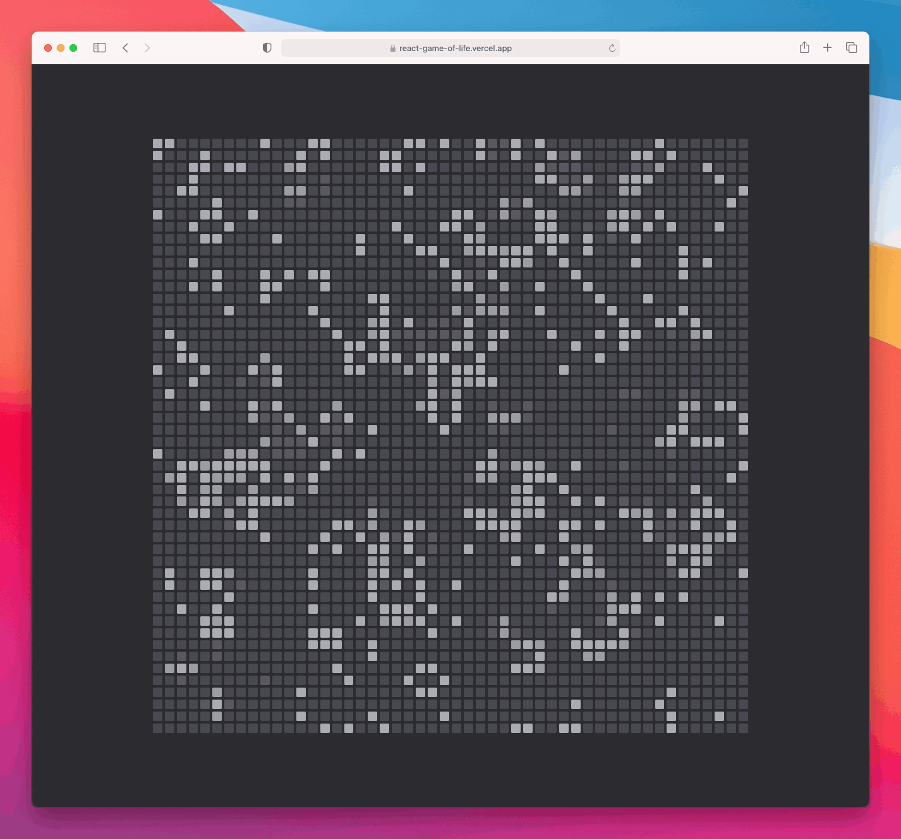

  

<h1 align="center">Game of Life</h1>

    <strong>Conway's Game of Life in React</strong>

  

The [Game of Life](https://en.wikipedia.org/wiki/Conway%27s_Game_of_Life), also
known simply as Life, is a cellular automaton devised by the British
mathematician John Horton Conway in 1970.

It is a zero-player game, meaning that its evolution is determined by its
initial state, requiring no further input.

This is a web implementation of Conway's Game of Life using React, Next.js and
CSS modules.

 

## Showcase

 

## Development

1. **Requirements**

    You should have an LTS version of [Node.js](https://nodejs.org/en/)
    installed.

2. **Install the dependencies**

    Run `npm install` to install all neccesary packages.

3. **Run the application**

    Start the development server by running `npm run dev`.
